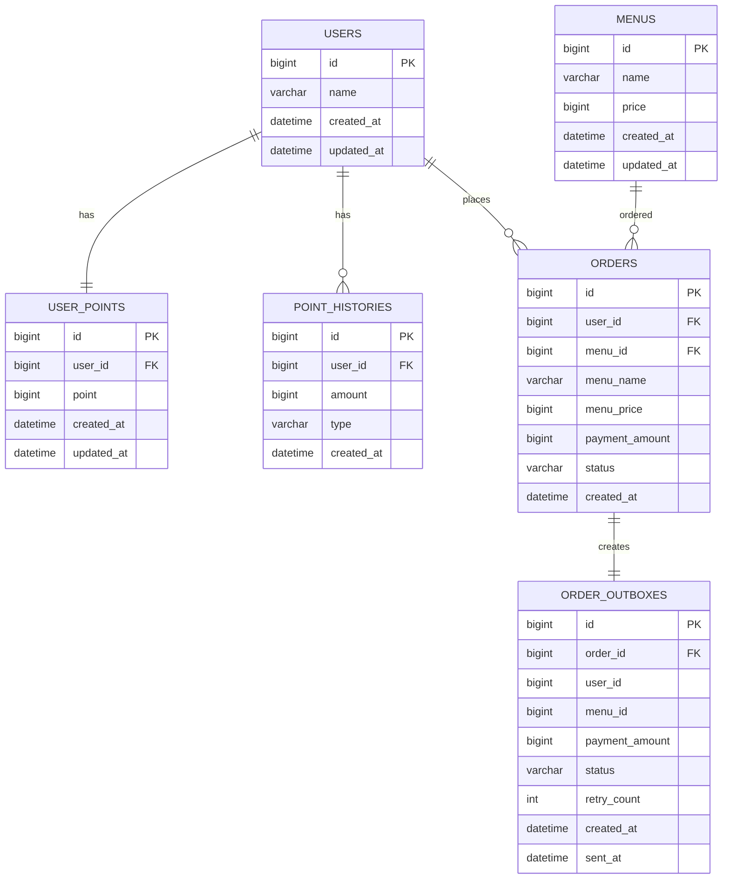

# 커피숍 주문 시스템

## 1. 요구사항 분석

이 프로젝트는 사용자가 포인트를 충전하고, 충전한 포인트로 커피를 주문할 수 있는 커피숍 주문 시스템입니다.  
또한 주문 내역을 기반으로 최근 7일간 인기 메뉴 3개를 조회할 수 있어야 합니다.

### 2. 필수 기능

| 기능 | 설명 |
|---|---|
| 커피 메뉴 목록 조회 | 메뉴 ID, 이름, 가격을 조회합니다. |
| 포인트 충전 | 사용자 ID와 충전 금액을 입력받아 포인트를 충전한다. 1원은 1P로 계산합니다. |
| 커피 주문/결제 | 사용자 ID와 메뉴 ID를 입력받아 주문하고, 메뉴 가격만큼 포인트를 차감합니다. |
| 인기 메뉴 조회 | 최근 7일간 결제 완료된 주문을 기준으로 주문 횟수가 많은 메뉴 3개를 조회합니다. |

### 3. 구현 기준

- 사용자는 `userId`로 식별합니다.
- 1회 주문은 커피 1잔 주문으로 정의합니다.
- 결제는 포인트로만 가능합니다.
- 포인트가 부족하면 주문은 실패합니다.
- 주문 성공 시 포인트 차감, 주문 저장, 포인트 이력 저장을 하나의 트랜잭션으로 처리합니다.
- 주문 성공 내역은 데이터 수집 플랫폼으로 전송하기 위해 Outbox 테이블에 저장합니다.
- 인기 메뉴는 최근 7일간 `COMPLETED` 상태의 주문만 집계합니다.
- 동시 주문 시 포인트가 중복 차감되지 않도록 사용자 포인트에 DB 비관적 락을 적용합니다.

---

## 4. ERD



---

## 5. 테이블 설명

| 테이블 | 설명 |
|---|---|
| `users` | 사용자 기본 정보를 저장합니다. |
| `user_points` | 사용자의 현재 포인트 잔액을 저장한다. 포인트 충전/차감 시 동시성 제어 대상이 됩니다. |
| `point_histories` | 포인트 충전, 사용 이력을 저장합니다. |
| `menus` | 커피 메뉴의 이름과 가격을 저장합니다. |
| `orders` | 커피 주문 내역을 저장한다. 주문 당시 메뉴명과 가격을 함께 저장합니다. |
| `order_outboxes` | 주문 성공 후 데이터 수집 플랫폼으로 전송할 데이터를 저장합니다. |

---

## 6. API 명세서

자세한 API 명세는 아래 Notion 문서에 정리했습니다.

- [커피 주문 시스템 API 명세서](https://app.notion.com/p/API-39ccd1f1b02f80f0a339e5489e04b8a4#39ccd1f1b02f80cb932dca800306e006)

## 7. 설계의 의도

### 7-1. User와 UserPoint 분리

사용자 기본 정보와 포인트 잔액은 변경 빈도가 다릅니다.  
포인트는 충전과 주문 결제 시 자주 변경되므로 `user_points` 테이블로 분리했습니다.  
이를 통해 포인트 변경 시 락을 걸어야 하는 대상을 명확히 할 수 있습니다.

### 7-2. 주문 테이블에 메뉴 스냅샷 저장

주문 이후 메뉴 이름이나 가격이 변경될 수 있습니다.  
과거 주문 내역은 주문 당시의 정보를 유지해야 하므로 `orders` 테이블에 `menu_name`, `menu_price`, `payment_amount`를 함께 저장했습니다.

### 7-3. Outbox 테이블 사용

주문 성공 후 데이터 수집 플랫폼으로 사용자 ID, 메뉴 ID, 결제 금액을 전송해야 합니다.  
외부 API 호출을 주문 트랜잭션 내부에서 직접 수행하면 외부 장애가 주문 처리에 영향을 줄 수 있습니다.  
따라서 주문 트랜잭션 안에서는 전송 대상 데이터를 `order_outboxes`에 저장하고, 커밋 이후 Mock 전송 로직을 실행하도록 설계했습니다.

### 7-4. 인기 메뉴는 원본 주문 데이터 기준 집계

인기 메뉴는 정확한 주문 횟수가 중요합니다.  
따라서 캐시가 아닌 `orders` 원본 테이블을 기준으로 최근 7일간 `COMPLETED` 주문을 집계했습니다.

---

## 8. 선택한 문제 해결 전략 및 분석 내용

### 8-1. 포인트 동시성 문제

동일 사용자가 동시에 주문을 요청하면 두 요청이 같은 포인트 잔액을 조회하여 중복 차감이 발생할 수 있습니다.

예시 상황:

```text
사용자 포인트: 5,000P
아메리카노 가격: 4,500P
동시에 주문 요청 2개 발생
```

동시성 처리가 없다면 두 요청이 모두 성공할 수 있습니다.  
이를 방지하기 위해 `UserPoint` 조회 시 DB 비관적 락을 사용했습니다.

```java
@Lock(LockModeType.PESSIMISTIC_WRITE)
@Query("select p from UserPoint p where p.userId = :userId")
Optional<UserPoint> findByUserIdForUpdate(Long userId);
```

DB 락은 여러 서버 인스턴스가 동시에 접근해도 동일하게 적용되므로, 다수 서버 환경에서도 포인트 정합성을 보장할 수 있습니다.

### 8-2. 트랜잭션 일관성

주문/결제 과정에서는 다음 작업들이 하나의 작업 단위로 처리되어야 합니다.

```text
포인트 차감
주문 저장
포인트 사용 이력 저장
Outbox 저장
```

이 중 일부만 성공하면 데이터 불일치가 발생할 수 있으므로 `@Transactional`로 하나의 트랜잭션으로 묶었습니다.

### 8-3. 데이터 플랫폼 전송 실패 대응

외부 데이터 플랫폼 전송이 실패하더라도 이미 성공한 주문이 실패 처리되면 안 된다고 판단했습니다.  
따라서 전송 상태를 `PENDING`, `SENT`, `FAILED`로 관리하고, 실패 시에도 주문 데이터는 유지되도록 설계했습니다.

---

## 9. 기술적 선택 이유

| 기술 | 선택 이유 |
|---|---|
| Spring Boot | REST API 서버를 빠르게 구성할 수 있고, 계층형 구조로 기능을 분리하기 쉽습니다. |
| Spring Data JPA | 반복적인 CRUD 코드를 줄이고, 도메인 중심으로 데이터를 다룰 수 있습니다. |
| MySQL | 실제 운영 환경과 가까운 관계형 데이터베이스를 사용하기 위해 선택했습니다. |
| H2 | 테스트 환경에서 빠르게 독립적인 DB 테스트를 수행하기 위해 사용했습니다. |
| Pessimistic Lock | 포인트 차감은 정합성이 중요하므로 동시에 같은 row를 수정하지 못하도록 DB 락을 사용했습니다. |
| Transaction | 주문, 포인트 차감, 이력 저장이 일부만 성공하는 문제를 방지하기 위해 사용했습니다. |
| Outbox Pattern | 외부 전송 실패가 주문 트랜잭션에 영향을 주지 않도록 분리하기 위해 사용했습니다. |
| JUnit / AssertJ | 기능과 제약사항을 검증하는 테스트를 작성하기 위해 사용했습니다. |

---

## 10. 실행 방법

### MySQL 데이터베이스 생성

```sql
CREATE DATABASE coffeeshop_db
DEFAULT CHARACTER SET utf8mb4
COLLATE utf8mb4_unicode_ci;
```

### 애플리케이션 실행

```bash
./gradlew bootRun
```

Windows 환경:

```bash
.\gradlew bootRun
```

### 테스트 실행

```bash
./gradlew test
```

Windows 환경:

```bash
.\gradlew test
```
