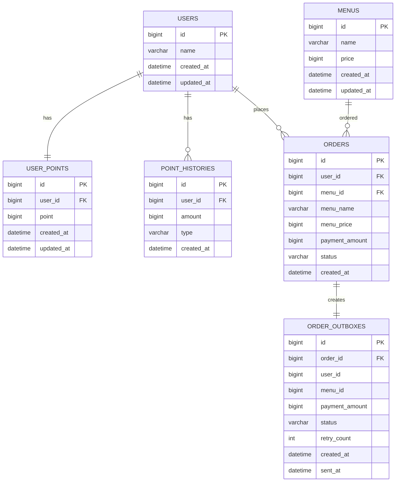

# 커피숍 주문 시스템

## 요구사항 분석

이 프로젝트는 사용자가 포인트를 충전하고, 충전한 포인트로 커피를 주문할 수 있는 커피숍 주문 시스템입니다.  
또한 주문 내역을 기반으로 최근 7일간 인기 메뉴 3개를 조회할 수 있어야 합니다.

### 필수 기능

| 기능 | 설명 |
|---|---|
| 커피 메뉴 목록 조회 | 메뉴 ID, 이름, 가격을 조회합니다. |
| 포인트 충전 | 사용자 ID와 충전 금액을 입력받아 포인트를 충전한다. 1원은 1P로 계산합니다. |
| 커피 주문/결제 | 사용자 ID와 메뉴 ID를 입력받아 주문하고, 메뉴 가격만큼 포인트를 차감합니다. |
| 인기 메뉴 조회 | 최근 7일간 결제 완료된 주문을 기준으로 주문 횟수가 많은 메뉴 3개를 조회합니다. |

### 구현 기준

- 사용자는 `userId`로 식별합니다.
- 1회 주문은 커피 1잔 주문으로 정의합니다.
- 결제는 포인트로만 가능합니다.
- 포인트가 부족하면 주문은 실패합니다.
- 주문 성공 시 포인트 차감, 주문 저장, 포인트 이력 저장을 하나의 트랜잭션으로 처리합니다.
- 주문 성공 내역은 데이터 수집 플랫폼으로 전송하기 위해 Outbox 테이블에 저장합니다.
- 인기 메뉴는 최근 7일간 `COMPLETED` 상태의 주문만 집계합니다.
- 동시 주문 시 포인트가 중복 차감되지 않도록 사용자 포인트에 DB 비관적 락을 적용합니다.

---

## ERD

---

## 테이블 설명

| 테이블 | 설명 |
|---|---|
| `users` | 사용자 기본 정보를 저장합니다. |
| `user_points` | 사용자의 현재 포인트 잔액을 저장한다. 포인트 충전/차감 시 동시성 제어 대상이 됩니다. |
| `point_histories` | 포인트 충전, 사용 이력을 저장합니다. |
| `menus` | 커피 메뉴의 이름과 가격을 저장합니다. |
| `orders` | 커피 주문 내역을 저장한다. 주문 당시 메뉴명과 가격을 함께 저장합니다. |
| `order_outboxes` | 주문 성공 후 데이터 수집 플랫폼으로 전송할 데이터를 저장합니다. |

---

## 설계 의도

`user_points`를 별도 테이블로 분리한 이유는 포인트가 충전과 주문 결제 시 자주 변경되는 데이터이기 때문이다. 동일 사용자가 동시에 주문하더라도 포인트가 중복 차감되지 않도록 해당 row에 비관적 락을 적용합니다.

`orders`에는 `menu_id`뿐만 아니라 `menu_name`, `menu_price`도 함께 저장한다. 메뉴 가격이나 이름이 나중에 변경되더라도 과거 주문 내역은 주문 당시 정보를 유지해야 하기 때문입니다.

주문 성공 후 데이터 수집 플랫폼으로 전송해야 하는 데이터는 `order_outboxes`에 저장한다. 외부 전송 실패가 주문 트랜잭션에 영향을 주지 않도록 주문 저장과 외부 전송 처리를 분리하기 위함입니다.

인기 메뉴는 정확한 주문 횟수가 중요하므로 캐시가 아닌 `orders` 원본 데이터를 기준으로 최근 7일간 `COMPLETED` 주문만 집계합니다.

## API 명세서

자세한 API 명세는 아래 Notion 문서에 정리했습니다.

- [커피 주문 시스템 API 명세서](https://app.notion.com/p/API-39ccd1f1b02f80f0a339e5489e04b8a4#39ccd1f1b02f80cb932dca800306e006)
